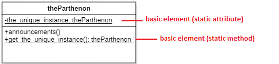
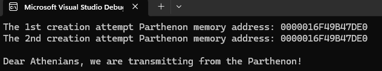

## Ο Παρθενώνας
Παράδειγμα εφαρμογής του Προτύπου Σχεδίασης Singleton
 

## Διάγραμμα κλάσεων
Το διάγραμμα κλάσεων θα μπορούσε να είναι το εξής:
 

 

## Command line
Μεταγλώττιση/εκτέλεση κώδικα:
 

 

## Ενδεικτικός κώδικας
Κάντε κλικ [εδώ](./source_code) (C++).
